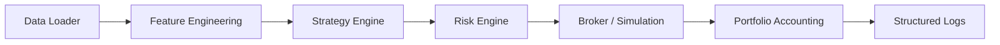

# Argus System: Master Specification

## 1. Introduction

**Project Argus** is a high-frequency-capable, low-capital trading system designed to operate 24/7 in crypto markets using the "Aegean" momentum strategy.

### **Core Tenets**
1.  **Low-Capital Survival**: Capable of trading accounts as small as $30 without zeroing out (Gambler's Ruin protection), while scaling up to large capital.
2.  **Deterministic Execution**: Given the same history and parameters, the backtest MUST produce bit-exact same results every time. No lookahead bias is tolerated.
3.  **Safety First**: Preventing catastrophic loss is prioritized over maximizing profit. The system must survive chop to profit in trends.
4.  **Production Grade**: Python-first architecture that is modular, testable, and robust, with improved developer ergonomics over the Swift MVP.

---

## 2. Architecture Overview

The system follows a pipeline architecture, where data flows through distinct stages.

### **Modules & Responsibilities**

1.  **Data Loader (`src/argus/data`)**: 
    - Loads OHLCV data from CSVs.
    - Handles timestamp alignment and gaps.
    - **CRITICAL**: Enforces strict "point-in-time" delivery. No future bars access.

2.  **Feature Engineering (`src/argus/features`)**:
    - Calculates indicators (EMA, ATR, Slope, etc.).
    - Manages rolling buffers of history (e.g., last 400 candles).
    - **Aegean Indicator**: The primary signal generator.

3.  **Strategy Engine (`src/argus/strategy`)**:
    - Receives features and current state.
    - Decides **Entry** (Buy/Sell) or **Exit** actions.
    - Interprets regime (Trend vs Chop).
    - **Signals**: Strong Buy, Buy, Sell, Strong Sell, Neutral (via "The Council").

4.  **Risk Engine (`src/argus/risk`)**:
    - **Chiron Regime Engine**: Detects market state (Trend/Chop).
    - **R-Model**: The "Veto" layer. Rejects trades based on:
        - Daily Loss Limit / Max Drawdown.
        - Risk Budget per Regime.
        - Notional value checks (min/max).

5.  **Broker / Execution (`src/argus/broker`)**:
    - **PaperBroker**: Simulates order execution.
        - Slippage modelling.
        - Commission/Fee accounting.
        - **Dynamic Brackets**: Manages SL/TP logic issued by Strategy.
    - **LiveBroker** (Future): Exchange API connection.

6.  **Portfolio (`src/argus/portfolio`)**:
    - Tracks Equity, Balance, Free Margin.
    - Tracks Open Positions and History.

---

## 3. The Council (Multi-Confirmation Strategy)

Argus moves beyond single indicators to a voting system ("The Council") orchestrated by `ArgusDecisionEngine`.

### **Modules**
1.  **Orion (Trend Hunter)**: 
    - Analyzes ADX, Moving Averages, Market Structure. 
    - Scans for sustained momentum.
2.  **Phoenix (Mean Reversion)**:
    - Analyzes Bollinger Bands, RSI, Regression Channels.
    - Scans for overextended moves and "return to mean".
3.  **Aegean (Momentum)**:
    - The tactical trigger (Slope + Zone).
    - Used to time the entry decided by Orion/Phoenix.

### **The Debate (Consensus Logic)**
- **Trend Regime**: Orion vote weight = 2.0x.
- **Chop Regime**: Phoenix vote weight = 2.0x.
- **Decision**:
    - **Buy**: Weighted Score > 65.
    - **Sell**: Weighted Score < 35.
    - **Veto**: If any module has Strong Objection (>80 opp), trade is blocked.

---

## 4. Chiron: Adaptive Risk & Execution

The `ChironRegimeEngine` adapts system behavior to market conditions.

### **Regime Detection**
- **Trend**: Low Chop Index, High ADX. -> Full Risk, Wide Stops.
- **Chop**: High Chop Index, Low ADX. -> Reduced Risk (0.5x), Tight Targets.
- **Risk-Off**: High Volatility. -> No Entry (0.0x).

### **Execution Plan**
Every trade must have a generated plan:
1.  **Stop Loss (SL)**: 
    - Dynamic based on Regime (Wide in Trend, Tight in Chop).
    - Never enter without SL.
2.  **Take Profit (TP)**:
    - Dynamic R:R based on volatility.
3.  **Active Management**:
    - **Time Stop**: Exit if trade stagnates for N hours.
    - **Trailing Stop**: Activates after profit threshold.

---

## 5. Risk Management (The "Veto" Layer)

Risk rules constitute a "hard block" on any strategy decision.

1.  **Daily Loss Cap**: If daily PnL < -3%, halt trading for 24h.
2.  **Max Drawdown**: If equity drop from high-water mark > 6%, halt indefinitely.
3.  **Consecutive Losses**: Stop after 3 losses in a row. Cooldown for N bars.
4.  **Min/Max Notional**: 
    - Dynamic Check: For <$100 accounts, minNotional drops to $1.00 (or 5% of balance).
    - Prevents "0 trade" issues in backtesting.

---

## 6. Backtest Methodology

### **Time-Step Simulation**
- The engine runs a loop: `for bar in History:`.
- At `bar[i]`, the strategy ONLY sees `bar[0...i]`.
- Trade execution for a signal at `bar[i]` happens at `bar[i].close` price (simplified) or `bar[i+1].open` (realistic).
- **Execution**: Market orders with modeled slippage.

### **Metrics & Reporting**
- **Total Net Profit**: Raw PnL.
- **Profit Factor**: Gross Win / Gross Loss.
- **Win Rate**: % of profitable trades.
- **Max Drawdown %**: Deepest valley in equity curve.
- **Expectancy**: Average PnL per trade.
- **Regime Performance**: PnL breakdown by Trend vs Chop regime.

---

## 7. Roadmap & Future

1.  **Phase P1-P2**: Core Engine + Aegean Parity.
2.  **Phase P3**: The Council (Orion/Phoenix Integration).
3.  **Phase P4**: Chiron Risk Engine (Regime Detection).
4.  **Phase P5**: Advanced Exits (Trailing/Time).
5.  **Phase P6**: Optimization & Live Bridge.

---
**Assumptions**:
- CSV Format: standard binance style `timestamp,open,high,low,close,volume`.
- Base Currency: USDT (or USD equiv).
- Python 3.10+.

---
**Assumptions**:
- CSV Format: standard binance style `timestamp,open,high,low,close,volume`.
- Base Currency: USDT (or USD equiv).
- Python 3.10+.
