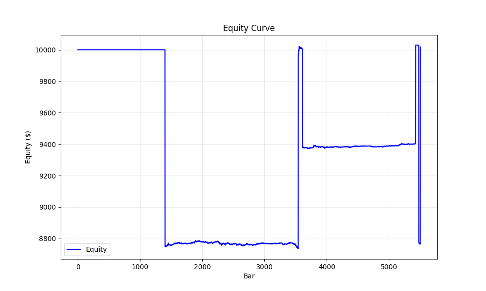
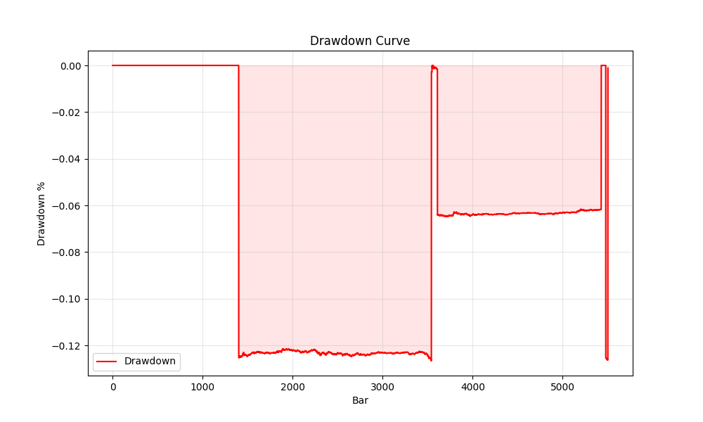

# Argus Run Report
**Run ID:** `20260202_120553_793474`
**Symbol:** BTCUSDT | **Mode:** adaptive

## Data Summary
**Bars:** 5761 | **From:** 2024-01-01 00:00:00 | **To:** 2024-01-05 00:00:00
**Price Range:** 40887.99 - 45874.92

## Performance Summary
| Metric | Value |
|---|---|
| Total Return | 0.18% |
| Max Drawdown | 12.66% |
| Final Equity | $10017.74 |
| Total Trades | 5 |
| Win Rate | 40.0% |
| Profit Factor | 1.45 |

## Visualization



## Parameters
| Param | Value |
|---|---|
| Fee (bps) | 10.0 |
| Slippage (bps) | 0.0 |
| Spread (bps) | 1.0 |
| Use Bid/Ask | True |
| Max Risk Cap | 1.0% |
| Liq Margin | 20.0% |

<details>
<summary>Full Config JSON</summary>

```json
{
  "mode": "adaptive",
  "symbol": "BTCUSDT",
  "data_dir": "argus_py/data",
  "start_balance": 10000.0,
  "leverage_max": 1.0,
  "sniper": false,
  "close_at_end": true,
  "profile": "AUTO",
  "council_threshold": 0.4,
  "min_conviction": null,
  "chop_floor": null,
  "trend_floor": null,
  "exit_policy": "FIXED_BRACKET",
  "cooldown_bars": 3,
  "auto_capital_mode": true,
  "capital_profile": null,
  "start_date": "2024-01-01",
  "end_date": "2024-02-01",
  "download_binance": false,
  "min_warmup": 10,
  "debug": false,
  "verify_data": false,
  "quiet": true,
  "max_bars": null,
  "report": true,
  "lab_grid": false,
  "fee_bps": 10.0,
  "slippage_bps": 0.0,
  "spread_bps": 1.0,
  "funding_bps_per_8h": 0.0,
  "use_bid_ask": true,
  "max_risk_per_trade_pct": 1.0,
  "max_notional_pct_of_equity": 100.0,
  "liq_safety_margin_pct": 20.0,
  "min_expected_move_bps": 0.0,
  "min_expected_move_multiplier": 0.0,
  "cost_safety_factor": 2.0,
  "cost_safety_homerun": 1.3,
  "atr_k": 1.0,
  "adx_boost": 1.3,
  "cooldown_bars_loss": 0,
  "exp_cap_mult": 1.5,
  "adaptive_cost_safety": false,
  "safety_percentile": 30.0
}
```
</details>

### Top Winners
_Analysis Error: Missing optional dependency 'tabulate'.  Use pip or conda to install tabulate._
## Signal Analysis
### Block Reasons
| Reason | Count |
|---|---|
| LOW_CONVICTION | 1354 |
| WARMUP | 98 |

**Avg Conviction:** 20.34 | **Max Conviction:** 90.00

## Last 10 Trades
_Error reading trades: Missing optional dependency 'tabulate'.  Use pip or conda to install tabulate._
