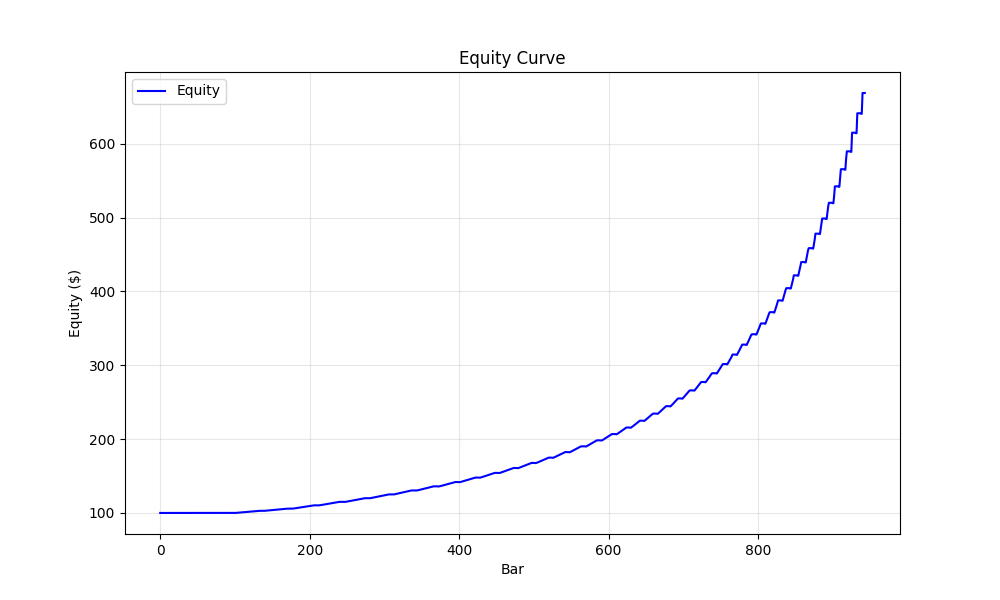
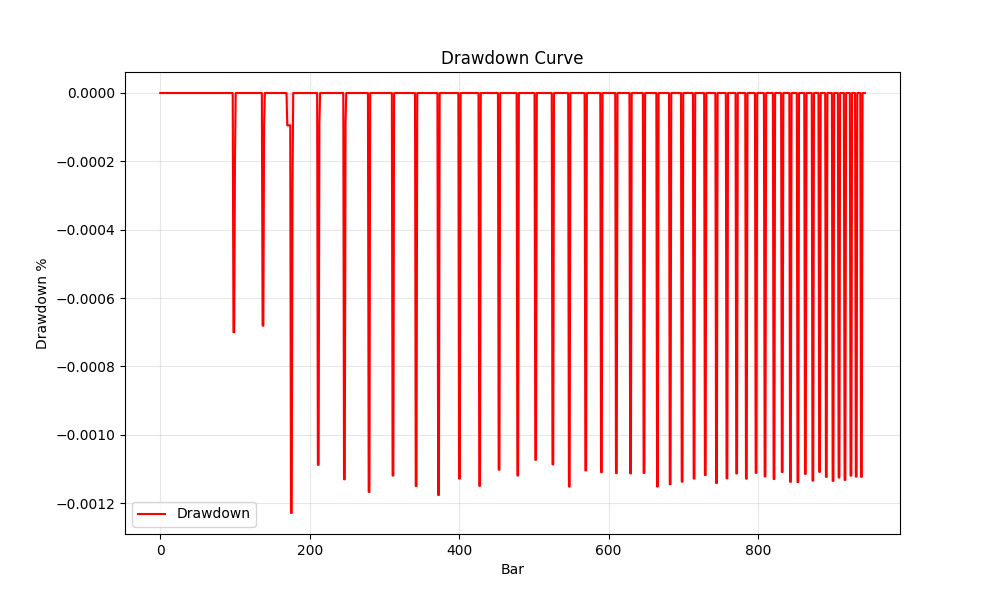

# Argus Run Report
**Run ID:** `20260131_150522_8b6fa7`
**Symbol:** BTCUSDT | **Mode:** adaptive

## Performance Summary
| Metric | Value |
|---|---|
| Total Return | 568.63% |
| Max Drawdown | 0.12% |
| Final Equity | $668.63 |
| Total Trades | 46 |
| Win Rate | 100.0% |
| Profit Factor | 999.00 |

## Visualization



## Configuration
<details>
<summary>Click to expand config</summary>

```json
{
  "mode": "adaptive",
  "symbol": "BTCUSDT",
  "data_dir": "argus_py/data",
  "start_balance": 100.0,
  "leverage_max": 1.0,
  "sniper": false,
  "close_at_end": true,
  "profile": "AUTO",
  "council_threshold": 0.4,
  "min_conviction": null,
  "chop_floor": null,
  "trend_floor": null,
  "exit_policy": "FIXED_BRACKET",
  "auto_capital_mode": true,
  "capital_profile": null,
  "start_date": null,
  "end_date": null,
  "debug": false,
  "max_bars": 1000,
  "report": true,
  "lab_grid": false
}
```
</details>

## Signal Analysis
### Block Reasons
| Reason | Count |
|---|---|
| WARMUP | 98 |

**Avg Conviction:** 21.95 | **Max Conviction:** 66.67

## Last 10 Trades
_Error reading trades: Missing optional dependency 'tabulate'.  Use pip or conda to install tabulate._
