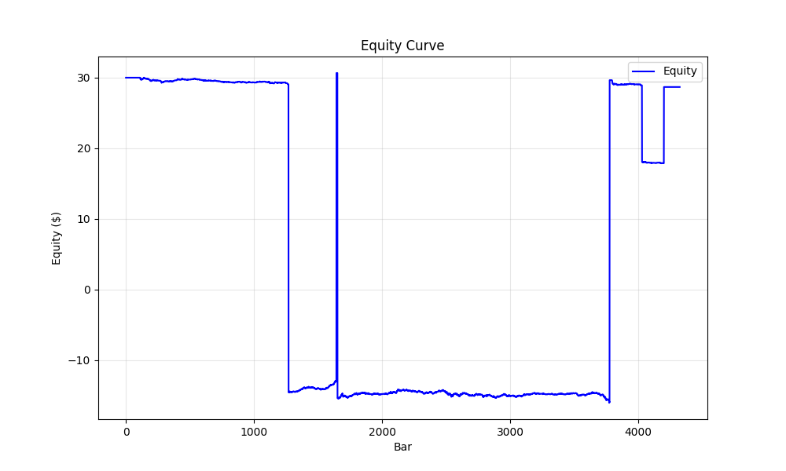
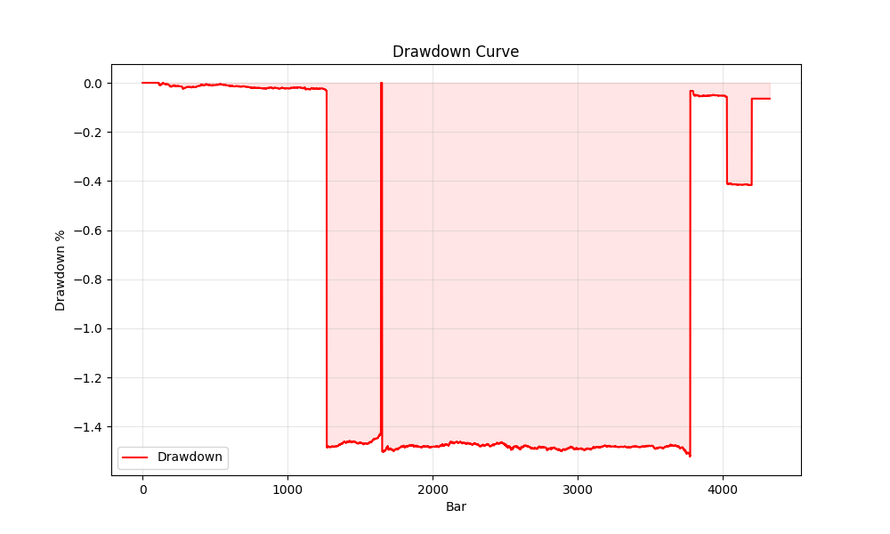

# Argus Run Report
**Run ID:** `20260131_183816_4486e6`
**Symbol:** BTCUSDT | **Mode:** adaptive

## Data Summary
**Bars:** 4320 | **From:** 2024-01-01 00:00:00 | **To:** 2024-01-03 23:59:00
**Price Range:** 40887.99 - 48883.99

## Performance Summary
| Metric | Value |
|---|---|
| Total Return | -4.40% |
| Max Drawdown | 152.26% |
| Final Equity | $28.68 |
| Total Trades | 6 |
| Win Rate | 16.7% |
| Profit Factor | 0.56 |

## Visualization



## Configuration
<details>
<summary>Click to expand config</summary>

```json
{
  "mode": "adaptive",
  "symbol": "BTCUSDT",
  "data_dir": "argus_py/data",
  "start_balance": 30.0,
  "leverage_max": 1.0,
  "sniper": false,
  "close_at_end": true,
  "profile": "AUTO",
  "council_threshold": 0.4,
  "min_conviction": null,
  "chop_floor": null,
  "trend_floor": null,
  "exit_policy": "FIXED_BRACKET",
  "cooldown_bars": 3,
  "auto_capital_mode": true,
  "capital_profile": null,
  "start_date": "2024-01-01",
  "end_date": "2024-01-04",
  "download_binance": true,
  "min_warmup": 200,
  "debug": false,
  "max_bars": null,
  "report": true,
  "lab_grid": false
}
```
</details>

## Signal Analysis
### Block Reasons
| Reason | Count |
|---|---|
| LOW_CONVICTION | 135 |
| WARMUP | 98 |

**Avg Conviction:** 12.66 | **Max Conviction:** 90.00

## Last 10 Trades
_Error reading trades: Missing optional dependency 'tabulate'.  Use pip or conda to install tabulate._
