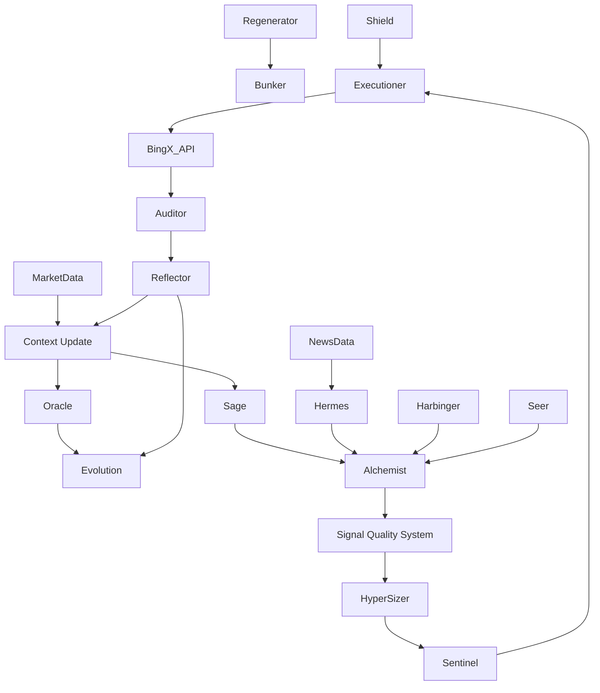

# ARGUS v2.5 System Overview & Feasibility Analysis

## 1. Hardware Feasibility Analysis

**Target Hardware:**
- **GPU:** NVIDIA RTX A3000M (6GB VRAM)
- **CPU:** Intel Core i7-11800H (8 Cores, 16 Threads)
- **RAM:** 32GB DDR4

**Verdict: HIGHLY FEASIBLE (With Specific Constraints)**

The proposed 21-module architecture is computationally intensive but entirely possible on this hardware if specific architectural choices are made regarding the ML components.

### 1.1 GPU Constraints (6GB VRAM)
- **Constraint:** You cannot run modern Large Language Models (LLMs) like Llama-3-8B or Mistral-7B locally for news analysis while simultaneously running trading logic. Even quantized (4-bit), these models consume ~5-6GB VRAM, leaving no headroom for OS or other tasks.
- **Solution:**
    - **News/Sentiment (Hermes):** Do NOT use LLMs. Use **FinBERT** (ProsusAI/finbert) or similar transformer models specialized for finance. These are ~400MB-1GB and run incredibly fast on an A3000M.
    - **Prediction (Oracle/Seer):** Use **XGBoost / LightGBM** (GPU accelerated) or small LSTM/GRU networks. These fit easily within 6GB VRAM.
    - **Training:** Train models offline (scheduled tasks), not during live trading.

### 1.2 CPU Capabilities (i7-11800H)
- **Strength:** This is a high-performance mobile CPU.
- **Role:**
    - **Darwin (Genetic Algorithms):** GAs are CPU-heavy. The 16 threads allow for parallel evaluation of 16 genomes simultaneously.
    - **Reflector (Simulations):** Counterfactual simulations (1000 runs) are perfect for parallel CPU execution.
    - **Data Processing:** Parquet I/O and feature engineering will be fast.

### 1.3 RAM (32GB)
- **Verdict:** Sufficient.
- **Optimization:** Use **Polars** or **PyArrow** instead of Pandas where possible to minimize memory overhead. 32GB allows holding ~10-20 years of 1-minute OHLCV data for multiple assets in memory if needed, though disk-based loading (Time Machine) is preferred.

---

## 2. System Map (Architecture)

The system is organized into **6 Layers** to ensure separation of concerns and fault tolerance.

### Layer 1: Infrastructure & Resilience (The Foundation)
*   **19. Bunker:** The isolated runtime environment (Docker/Podman). Manages secrets, environmental variables, and hardware access.
*   **3. Regenerator:** System watchdog. Detects frozen processes or memory leaks and restarts modules automatically.
*   **20. Shield & Mirror:**
    *   *Shield:* API Rate limit manager (prevent 429 errors).
    *   *Mirror:* Data backup to secondary local drive/cloud.
*   **18. Chaos Engine:** Randomly terminates non-critical components (in staging) to test Regenerator's recovery speed.

### Layer 2: Data Fabric (Time Machine)
*   **21. Time Machine:** The central immutable data store.
    *   *Inputs:* OHLCV, Order Book (Snapshot), News.
    *   *Outputs:* Standardized DataFrames, Parquet files.
    *   *Storage:* Partitioned Parquet (By Asset / Month).
*   **5. Sage:** Vector Database / Similarity Search engine. Finds historical market regimes similar to the current one.
*   **2. Oracle:** Feature calculation engine. Computes Technical Indicators (TA-Lib/Pandas-TA) and Statistical Features (Hurst, Entropy).

### Layer 3: Signal Generation (The "Singularity")
*   **1. Darwin & Reflector:**
    *   *Darwin:* Genetic Algorithm that evolves strategy parameters (StopLoss %, WindowSize, EntryThreshold).
    *   *Reflector:* Post-trade analysis. Simulates "what if" scenarios to grade execution quality.
*   **6. Alchemist:** Alpha factory. Combines weak signals into strong composite signals.
*   **7. Hermes:** NLP / News Analysis.
    *   *Model:* FinBERT.
    *   *Output:* Sentiment Score [-1, 1], Volatility Impact Score [0, 1].
*   **8. Harbinger:** Macro & Correlation monitor. Detects market-wide stress (e.g., VIX spikes, Correlation breakdowns).
*   **9. Seer:** Predictive Model (XGBoost/LSTM). Predicts next-candle direction or volatility.
*   **10. Polyglot:** Asset-class normalizer. Ensures Crypto logic and Gold/Indices logic speak the same "Volatility" language.

### Layer 4: Decision & Risk (The "Brain")
*   **17. Sentinel:** Risk & Compliance Gate.
    *   *Checks:* Max Drawdown, Daily Loss Limit, Restricted Symbols, Exposure Cap.
*   **15. Hyper-Sizer:** Position Sizing Engine.
    *   *Input:* Signal Confidence, Account Equity, Market Volatility (ATR).
    *   *Logic:* Adaptive Kelly Criterion.
*   **Signal Quality System (SQS):** (Integrated into Layer 4)
    *   *Role:* Final gatekeeper. Vetoes trades if signal quality < Threshold.

### Layer 5: Execution (The "Hands")
*   **11. Executioner:** Order Management System (OMS).
    *   *Logic:* TWAP/VWAP or Iceberg orders (if size warrants). Smart routing to BingX.
*   **12. Chiron:** Health Healer. Monitors API connection health and latency. Switches to backup endpoints if primary fails.

### Layer 6: Learning & Audit (The "Memory")
*   **4. Auditor:** Real-time PnL tracking and integrity check. Reconciles local database with Exchange balance.
*   **13. Ghost:** Shadow trading engine. Runs experimental strategies (Paper Trading) alongside live strategies.
*   **14. Weaver:** Reporting engine. Generates daily PDF/HTML reports for human review.
*   **16. Hive:** Distributed computing interface (Optional/Future). Allows offloading Darwin/Reflector tasks to other machines.

---

## 3. Dependency Graph (Textual)

## 4. Hardware Resource Allocation Strategy

To ensure "Survival First" on the i7/A3000M:

1.  **Critical Path (Core 0-1):** Executioner, Sentinel, Auditor. These *never* wait.
2.  **Data Path (Core 2-3):** Time Machine, Oracle.
3.  **Analysis Path (Core 4-7 + GPU):**
    - **Hermes (GPU):** Loads FinBERT, processes news batch, unloads (to save VRAM).
    - **Darwin (Background):** Runs strictly on lowest priority threads (Nice=19).
    - **Reflector (Post-Trade):** Runs only after a trade closes.
4.  **Memory Management:**
    - **Strict Limit:** Darwin population size = 64 (Keep small to save RAM).
    - **Embargo:** Do not train models during trading hours. Train overnight.
