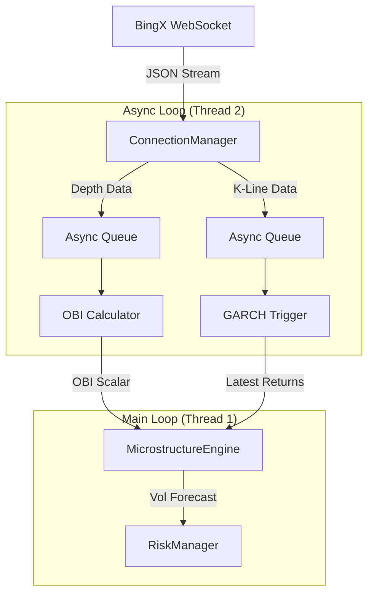

# ARGUS v2.5: Resilient WebSocket & Real-Time Data Flow

**Role:** HFT Network & Connectivity Engineer
**Objective:** Engineer a "Bulletproof" Real-Time Data Pipeline for ARGUS v2.5.
**Philosophy:** "Data is Oxygen" -> Zero-Downtime Architecture.

---

## 1. Robust Connection Management

### What
Borsa bağlantısı, internet dalgalanmaları veya sunucu tarafındaki yük nedeniyle her an kopabilir. Bizim sistemimiz, bağlantı koptuğunda "panik" yapmamalı, aksine önceden belirlenmiş bir matematiksel stratejiyle (Exponential Backoff) sessizce ve inatla yeniden bağlanmalıdır.

### Why
Basit bir `while True: connect()` döngüsü, borsa sunucularını spamlayarak IP ban yemenize neden olur. HFT sistemlerinde bağlantı yönetimi, strateji kadar kritiktir. Veri akışı durursa, risk yönetimi kör olur.

### How
`aiohttp` veya `websockets` kütüphanesi üzerine kurulu bir `ConnectionManager` sınıfı tasarlayacağız.
*   **Exponential Backoff:** İlk hata -> 1s bekle. İkinci hata -> 2s. Üçüncü -> 4s... Max -> 32s.
*   **Heartbeat (Ping/Pong):** Her 30 saniyede bir "Ping" gönderip "Pong" bekleyeceğiz. 10 saniye içinde Pong gelmezse, bağlantıyı "ölü" kabul edip zorla kapatıp yeniden açacağız (Force Reconnect).

---

## 2. Dual Stream Architecture

### What
Tek bir WebSocket kanalından her şeyi akıtmak yerine, verinin doğasına göre ayrıştırılmış kanallar kullanacağız.
*   **Stream A (L2 Depth):** Emir defterinin anlık fotoğrafı (Snapshot). Yoğun veri. OBI (Order Book Imbalance) için kritiktir.
*   **Stream B (K-Line):** Tamamlanmış mum verileri. Daha seyrek veri. GARCH(1,1) ve İndikatörler için kritiktir.

### Why
L2 verisi saniyede 10-20 kez gelebilir (High Throughput). K-Line ise dakikada bir gelir. Bunları aynı işlem kuyruğunda (Queue) tutmak, mum verisinin L2 verisi arkasında "boğulmasına" neden olabilir (Head-of-Line Blocking).

### How
Python `asyncio.Queue` kullanarak iki ayrı tüketici (Consumer) yaratacağız.
*   `process_depth_stream()`: Sadece en son snapshot'ı saklar (Conflation). Çünkü 1 saniye önceki derinlik verisinin HFT'de değeri yoktur.
*   `process_kline_stream()`: Her mumu saklar ve `MicrostructureEngine`'i tetikler.

---

## 3. Data Throttling & Buffer

### What
Borsadan gelen ham JSON verisini, Python nesnelerine (Dict/List) çevirip analiz etmek CPU maliyetlidir. Bu işlemi ana döngüden (Main Loop) izole edeceğiz.

### Why
i7-11800H güçlüdür ama Python'ın GIL (Global Interpreter Lock) sorunu vardır. Eğer WebSocket verisini işlerken CPU'yu kilitlerseniz, o sırada emriniz borsaya iletilemez.

### How
*   **Asyncio:** Ağ I/O işlemleri (veri alma) asenkron çalışır, CPU'yu bloklamaz.
*   **Polars/NumPy:** Veri geldiği anda JSON'dan çıkarılıp, doğrudan `numpy.array` veya `polars.DataFrame` formatına, minimal kopyalama (Zero-Copy) ile aktarılmalıdır.

---

## Integration Plan (Architecture)

