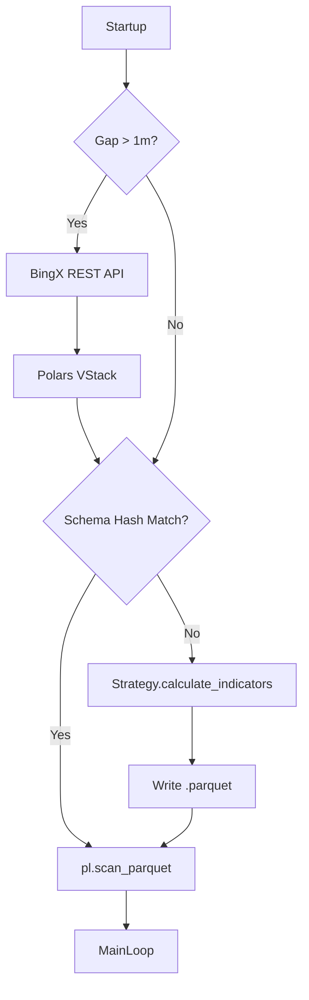

# ARGUS v2.5: Zero-Gap Data Factory

**Role:** Senior Data Architect & Database Engineer
**Objective:** Engineer a 100% Integrity Data Pipeline.
**Philosophy:** "Data Integrity is Non-Negotiable".

---

## 1. Gap Detection & REST Fallback (Veri Onarımı)

### What
Sistem her başlatıldığında veya periyodik aralıklarla, diskteki Parquet veri tabanının son zaman damgası (Timestamp) ile şimdiki zamanı karşılaştırıp, aradaki boşluğu (Gap) tespit eden ve otomatik olarak onaran mekanizma.

### Why
WebSocket bağlantısı kesilebilir, sunucu kapanabilir veya internet gidebilir. GARCH, RSI veya OBI gibi modeller "sürekli" (continuous) zaman serisine ihtiyaç duyar. Tek bir eksik mum bile volatilite tahminini saptırabilir.

### How
1.  **Check:** `data/ohlcv/{symbol}.parquet` dosyasını oku, `max(timestamp)` al.
2.  **Compare:** `Current_Time - Last_Time`. Eğer fark > 1 mum süresi ise -> **GAP DETECTED**.
3.  **Heal:** `ExchangeClient.fetch_ohlcv(start_time=Last_Time)` ile eksik veriyi çek.
4.  **Merge:** Yeni gelen veriyi Polars ile mevcut veriye `vstack` yap, `unique(subset=['timestamp'])` ile dublikeleri temizle ve kaydet.

---

## 2. Feature Schema Hashing & Versioning (Dinamik Güncelleme)

### What
Kod tabanındaki `Strategy.calculate_indicators()` fonksiyonunun imzasını (hangi sütunları ürettiğini) takip eden ve veri setindeki sütunlarla uyuşmazlık varsa, tüm veri setini "Recalculate" (yeniden hesapla) yapan sistem.

### Why
Sürekli yeni indikatörler ekliyoruz (ör. `close_frac`, `obi_scalar`). Eski veri setlerinde bu sütunlar yok. Kod çalıştığında `ColumnNotFoundError` almamak için verinin "Kodun son haline" otomatik adapte olması gerekir.

### How
1.  **Hash Logic:** Özellik listesini (ör. `['rsi', 'ema_50', 'garch_vol']`) al, sırala ve MD5 hash'ini çıkar.
2.  **Meta Store:** Bu hash'i Parquet dosyasının metadata kısmına veya yanına bir `.meta` dosyasına kaydet.
3.  **Validate:** Başlangıçta kodun ürettiği hash ile dosyadaki hash'i kıyasla. Farklıysa -> **Feature Drift Detected**.
4.  **Regenerate:** Ham OHLCV verisini al, indikatör fonksiyonunu tekrar çalıştır ve üzerine yaz.

---

## 3. High-Performance Persistence Layer (Polars + PyArrow)

### What
Geleneksel CSV veya Pandas Pickle yerine, sıkıştırılmış (Snappy/Zstd) Parquet formatı ve Rust tabanlı Polars kütüphanesi.

### Why
32GB RAM geniştir ama sonsuz değildir. Pandas, veriyi RAM'e yüklerken kopyalar (Copy-on-Write). Polars ise `LazyFrame` yapısıyla veriyi sadece ihtiyaç duyulduğunda ve optimize edilmiş sorgularla (Query Plan) çeker. RTX A3000M ve i7 işlemcinin tüm çekirdeklerini kullanır.

### How
*   **Lazy Loading:** `pl.scan_parquet()` ile veri taranır ama yüklenmez.
*   **Predicate Pushdown:** Sadece `filter(date > 2024)` gibi bir sorgu atıldığında, sadece ilgili dosyalar okunur.
*   **Streaming:** Büyük veri setleri (Backtest) için `collect(streaming=True)` kullanılır.

---

## Architecture Diagram

