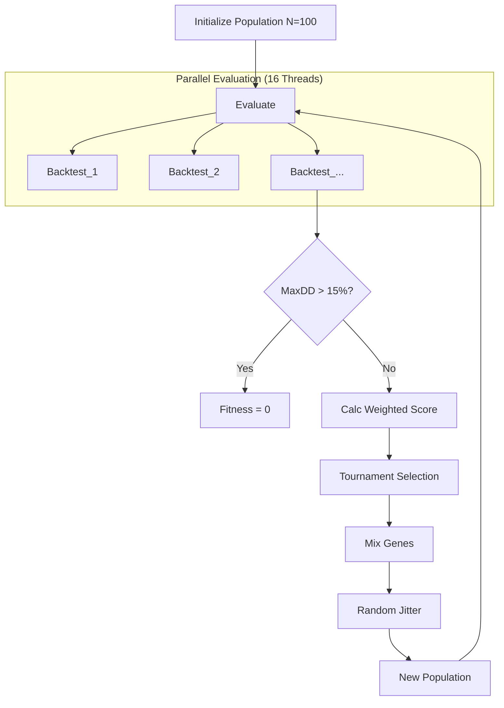

# ARGUS v2.5: Darwin Engine (Evolutionary Optimization)

**Role:** Senior ML Engineer & Quant Architect
**Objective:** Autonomous Strategy Evolution with "Survival First" Constraints.
**Philosophy:** "Survival of the Fittest" -> "Survival of the Least Fragile".

---

## 1. Strategy Representation (The Genome)

### What
Bir ticaret stratejisinin tüm parametrelerini sayısal bir dizi (vektör) olarak kodlayan yapıdır. Biyolojideki DNA gibi, bu genom stratejinin "nasıl davranacağını" belirler.

### Why
Elle parametre seçmek (ör. RSI=14, EMA=50) insan önyargısı içerir ve optimum değildir. Genetik Algoritma (GA), milyonlarca kombinasyonu tarayarak insan aklının bulamayacağı sinerjileri keşfeder.

### How
Genom, sabit uzunlukta bir `float` listesi veya `dict` olacaktır. Değerler [0, 1] aralığına normalize edilebilir veya doğrudan parametre aralığında (ör. 10-200) tutulabilir.

**Gene Map Example:**
1.  `ema_short_period` (10 - 100)
2.  `ema_long_period` (100 - 300)
3.  `rsi_period` (5 - 30)
4.  `rsi_upper_threshold` (60 - 90)
5.  `rsi_lower_threshold` (10 - 40)
6.  `stop_loss_atr_mult` (1.0 - 5.0)
7.  `take_profit_atr_mult` (1.5 - 10.0)

---

## 2. Multi-Objective Fitness Function (Hayatta Kalma Kriteri)

### What
Bir stratejinin "başarısını" tek bir sayıya indirgeyen formül. Ancak bu formül, sadece kârı değil, riski ve istikrarı da ölçer.

### Why
%500 kazandıran ama %80 Drawdown (sermaye erimesi) yaşayan bir strateji, "Survival First" prensibine göre **çöptür**. Çünkü %80 kayıp, yatırımcı psikolojisini bozar ve fonu batırır.

### How
1.  **Hard Constraint:** Eğer `Max_Drawdown > 15%` ise -> **Fitness = 0**. (Soyu tükenir).
2.  **Weighted Score:**
    $$ Fitness = (W_1 \times Sharpe) + (W_2 \times CAGR) - (W_3 \times MaxDD \times Penalty) $$
    *   $W_1 (Sharpe) = 2.0$ (Risk-Adjusted Return kraldır).
    *   $W_2 (CAGR) = 1.0$ (Büyüme önemlidir ama ikincil).
    *   $W_3 (Drawdown) = 5.0$ (Kayıp, kârdan çok daha fazla cezalandırılır).

---

## 3. Evolutionary Operators (Evrim Mekanizması)

### Selection (Doğal Seçilim)
*   **Method:** Tournament Selection. Rastgele 4 strateji seç, en yüksek Fitness puanına sahip olanı "Ebeveyn" (Parent) yap.
*   **Why:** En iyiyi (Elitism) korurken, şans eseri iyi olan zayıf bireylere de küçük bir şans tanır (çeşitlilik için).

### Crossover (Çaprazlama)
*   **Method:** Uniform Crossover. İki ebeveynin genlerini %50 ihtimalle karıştır.
    *   Child[0] = ParentA[0] or ParentB[0]
*   **Why:** İyi özelliklerin (ör. iyi bir Stop Loss ayarı ve iyi bir RSI periyodu) tek bir bireyde birleşmesini sağlar.

### Mutation (Mutasyon)
*   **Method:** Gaussian Jitter. Genlerin %10'una rastgele küçük bir değer ekle/çıkar (ör. RSI Period 14 -> 15).
*   **Why:** Yerel optimuma (Local Optima) sıkışmayı önler. Evrimin "keşif" (Exploration) gücüdür.

---

## 4. Parallelized Evaluation (Hardware Optimization)

### What
Popülasyondaki 100 bireyi sırayla değil, aynı anda test etme.

### Why
i7-11800H işlemcinin 16 Thread'i var. Sıralı yaparsak (Serial), bir jenerasyon 1 saat sürer. Paralel yaparsak 4-5 dakika sürer.

### How
Python `concurrent.futures.ProcessPoolExecutor` kullanarak her bir Genom'u ayrı bir işlemci çekirdeğine göndereceğiz. Polars verisi `Shared Memory` üzerinden okunarak RAM şişmesi engellenecek.

---

## Architecture

